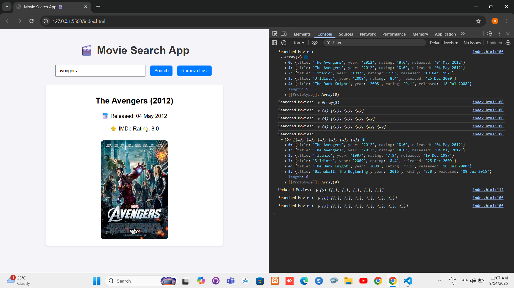

# 🎬 Movie Search App

A simple web application to search for movies using the OMDb API.  
It displays details such as **Title, Year, Release Date, IMDb Rating, and Poster**.

---

## 🚀 Features
- Search movies by name.  
- Displays movie details in a clean card layout.  
- Remove last searched movie from history.  
- Responsive and simple UI.  

---

## 🛠️ Technologies Used
- **HTML5**  
- **CSS3**  
- **JavaScript (Fetch API)**  
- **OMDb API** (for movie data)

---

## 📂 How to Run
1. Clone or download this repository.  
2. Open `index.html` in your browser.  
3. Type a movie name (e.g., `Avengers`, `Titanic`, `3 Idiots`) and click **Search**.

---

  ## 📸 Screenshot

